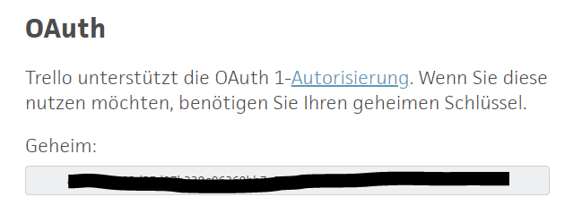
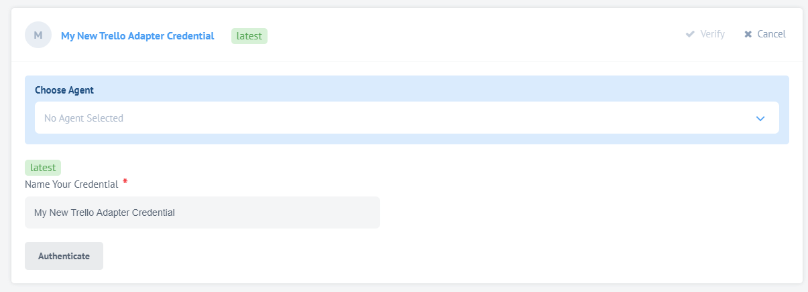
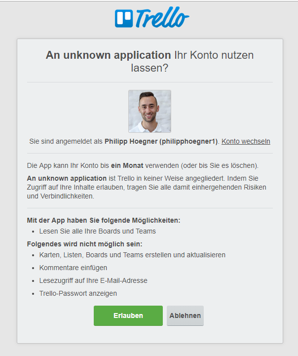

# Sugar CRM Component

[Trello](https://trello.com/) is a web-based project management software organized with boards, lists and tasks.

# Authentication
In order for the elastic.io platform to authenticate with Trello, the
following tasks need to be completed:
* An admin must manually add an APIKey and Secret as environment variables
  * API Key can be found under **https://trello.com/app-key** and must be named `apiKey`
  * Secret can also be found under **https://trello.com/app-key** (see bottom of the page) and must be named `secret`     
* When adding credentials the user (relating to api key and secret) is asked to authorize the trello adapter
* Finally, a token is provided by Trello which is used within the trello adapter

## Creating an app on a SugarCRM instance
In order the platform to connect to your SugarCRM instance, an app needs to be
created on that instance.  Below are the steps to do so.  Once that is done, you
will provide a valid username and password to the elastic.io platform.  The
platform will exchange that username and password for a token.  In a production
system, the best practice is to create a dedicated user for the elastic.io
platform.  This user should have the minimum required permissions.

1. As a user on the plattform go to https://trello.com/app-key

2. Look for the API keys

  

3. Look for the secret

  

4. Add the two environment variables to your repository

  

## Authentication on elastic.io

1. Click on `Authenticate`

  

2. Click on `Allow/Erlauben`

  

# Triggers
## GetBoards - Bulk Extract

It is possible to fetch all boards of the current user via the getBoards trigger.
The trigger returns information for all boards the user has access to.

# Actions
## GetBoardById

Given a board id, this action fetches all information about the board with the given id.
